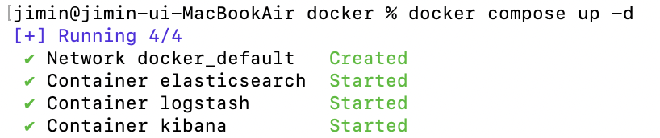
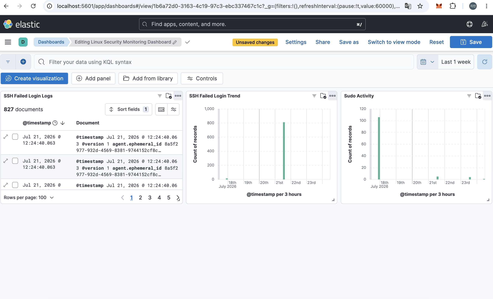
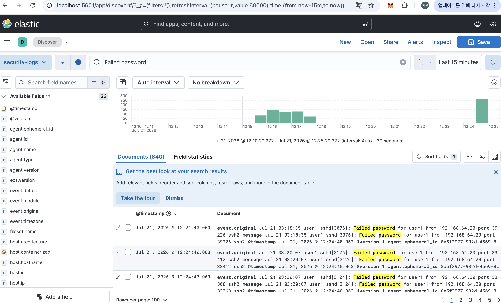
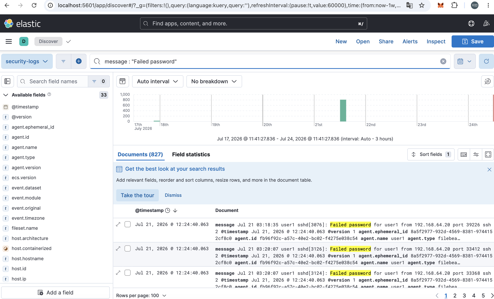
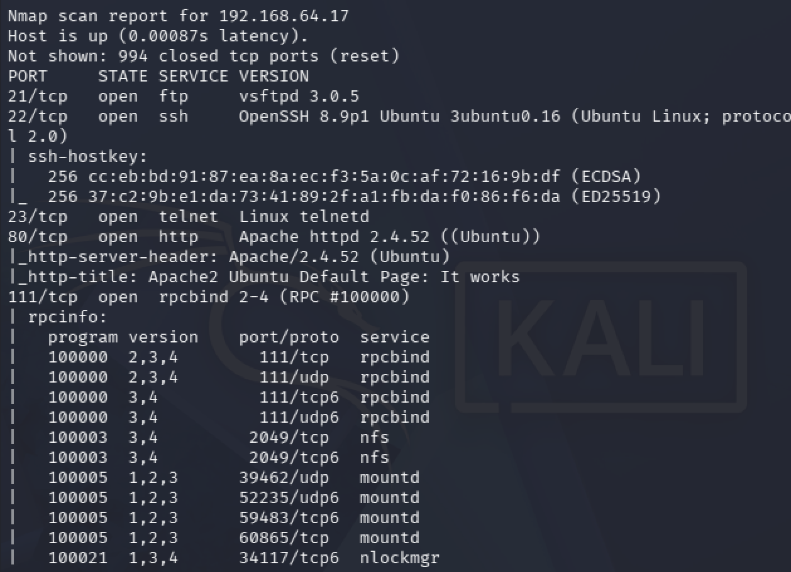
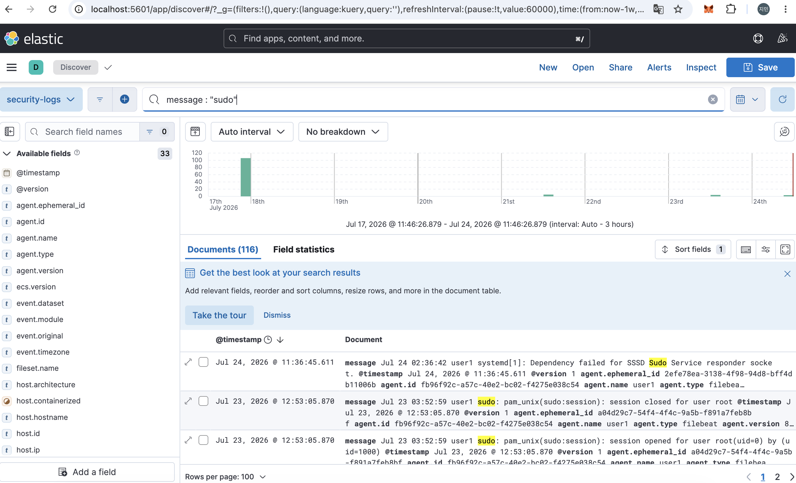

# ELK Stack을 활용한 Linux 보안관제 환경 구축 및 이상행위 탐지

## 프로젝트 소개

ELK Stack(Elasticsearch, Logstash, Kibana)과 Filebeat를 활용하여 Linux 서버의 보안 로그를 중앙에서 수집하고, Kibana를 통해 시각화 및 이상행위를 탐지하는 보안관제 환경을 구축한 프로젝트입니다.

Kali Linux를 이용하여 다양한 공격 시나리오를 수행하고, 생성된 로그를 분석하여 보안 이벤트를 탐지하는 과정을 직접 구현하였습니다.

---

## 프로젝트 기간

2026.07

---

## 프로젝트 목표

- ELK Stack 기반 보안관제 환경 구축
- Linux 시스템 로그 중앙 수집
- 공격 시나리오 수행 및 로그 분석
- Kibana Dashboard를 통한 보안 이벤트 시각화

---

## 기술 스택

| 분야 | 기술 |
|------|------|
| OS | Ubuntu Server 22.04 |
| 공격 환경 | Kali Linux |
| Container | Docker, Docker Compose |
| Log Collection | Filebeat |
| Log Processing | Logstash |
| Log Storage | Elasticsearch |
| Visualization | Kibana |

---

## 시스템 구성

```text
Kali Linux
      │
      │ 공격 수행
      ▼
Ubuntu Server
(auth.log / syslog)
      │
      ▼
Filebeat
      │
      ▼
Logstash
      │
      ▼
Elasticsearch
      │
      ▼
Kibana Dashboard
```

---

## 주요 수행 내용

### ELK Stack 구축

- Docker Compose를 활용하여 Elasticsearch, Logstash, Kibana 구축
- Kibana 정상 접속 확인

### 로그 수집

- Filebeat 설치
- auth.log 수집
- syslog 수집
- Logstash 연동
- Elasticsearch 저장 확인

### 공격 시나리오

- SSH 로그인 실패
- SSH Brute Force(Hydra)
- Nmap Port Scan
- sudo 명령 실행

### 로그 분석

- SSH 로그인 실패 이벤트 분석
- sudo 실행 이벤트 분석
- Port Scan 이벤트 확인

### Dashboard 구성

- SSH Failed Login Trend
- SSH Failed Login Logs
- Sudo Activity

---

## 프로젝트 결과

- ELK Stack 기반 Linux 보안관제 환경 구축 완료
- Filebeat를 이용한 Linux 인증 로그 중앙 수집
- SSH Brute Force 및 Port Scan 공격 로그 확인
- Kibana Dashboard를 통한 보안 이벤트 시각화 구현

---

## 프로젝트 구조

```text
security-monitoring
├── README.md
├── docker
│   ├── docker-compose.yml
│   ├── filebeat
│   │   ├── filebeat.yml
│   │   └── system.yml
│   └── logstash
│       └── pipeline
│           └── logstash.conf
├── docs
│   ├── architecture.md
│   ├── project_plan.md
│   ├── requirements_spec.md
│   └── work_log.md
├── logs
└── screenshots
```

---

# 주요 화면

## 1. ELK Stack 실행

Docker Compose를 이용하여 ELK Stack 컨테이너를 실행한 화면입니다.



---

## 2. Kibana Dashboard

최종적으로 구성한 보안관제 Dashboard입니다.

- SSH Failed Login Trend
- SSH Failed Login Logs
- Sudo Activity



---

## 3. Kibana Discover

Filebeat를 통해 수집된 Linux 인증 로그를 Kibana Discover에서 확인한 화면입니다.



---

## 4. SSH Brute Force 탐지

Hydra를 이용하여 SSH Brute Force 공격을 수행하고 Kibana에서 탐지한 결과입니다.



---

## 5. Port Scan 탐지

Nmap을 이용하여 대상 서버의 열린 포트 및 서비스를 확인한 결과입니다.



---

## 6. Sudo Activity

Linux에서 sudo 명령 실행 이벤트를 Kibana에서 확인한 화면입니다.



---

# 프로젝트를 통해 배운 점

- ELK Stack 기반 로그 수집 및 분석 환경을 직접 구축하며 보안관제 시스템의 전체 동작 과정을 이해할 수 있었습니다.
- Filebeat, Logstash, Elasticsearch의 연동 구조와 로그 처리 흐름을 경험하였습니다.
- SSH Brute Force, Port Scan 등의 공격 시나리오를 수행하고 실제 로그를 기반으로 탐지하는 과정을 익혔습니다.
- Kibana Dashboard를 구성하여 보안 이벤트를 시각적으로 분석하고 모니터링하는 방법을 학습하였습니다.
